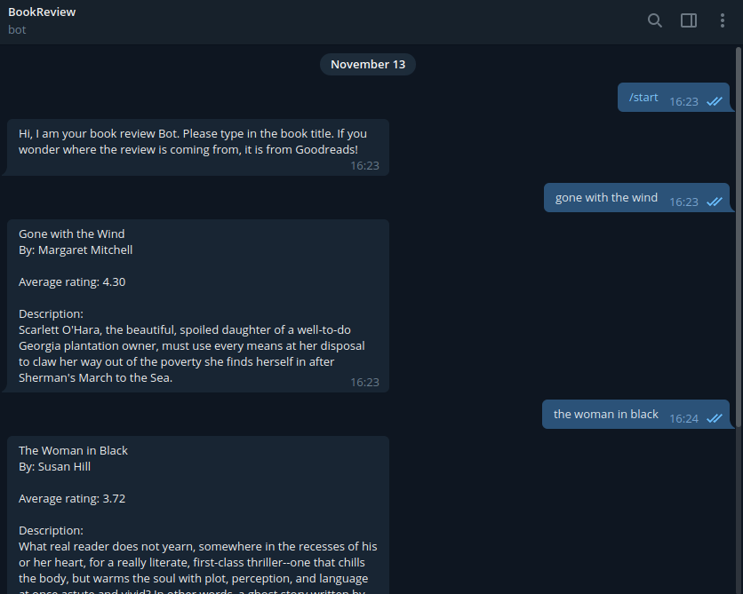

<h1>Telegram Bot - Book Review</h1>

<h2> DESCRIPTION </h2>

A personal project for Telegram Bot. This app is written in Java and is designed to retrieve book's complete title, author, review, and its description via Goodreads API.

 

It will look like this:
 
 

 
 
<h2> FUTURE PLAN </h2>
 
There are possible additionals features that will follow in future which is:
 
<ul>
<li> Additional documents to explain how it works, technically </li>
<li> Prettify codes</li>
</ul>
 
